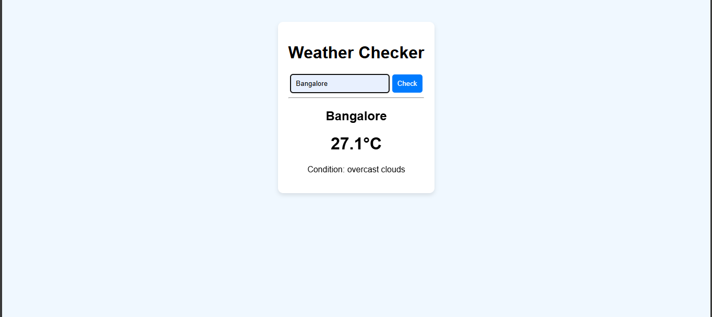
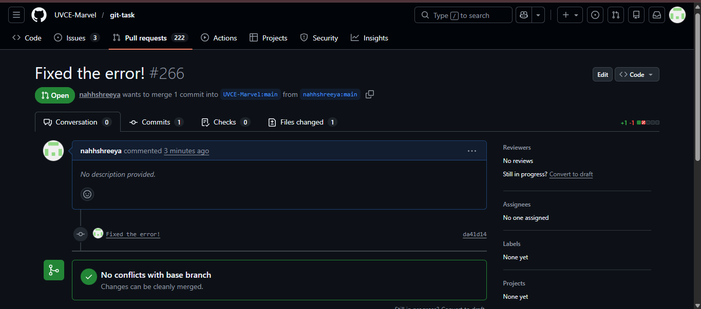
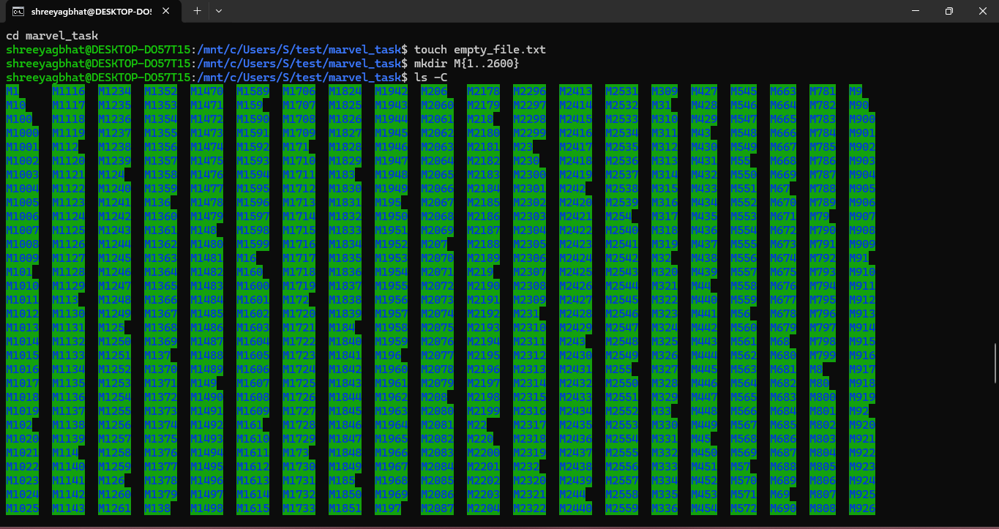
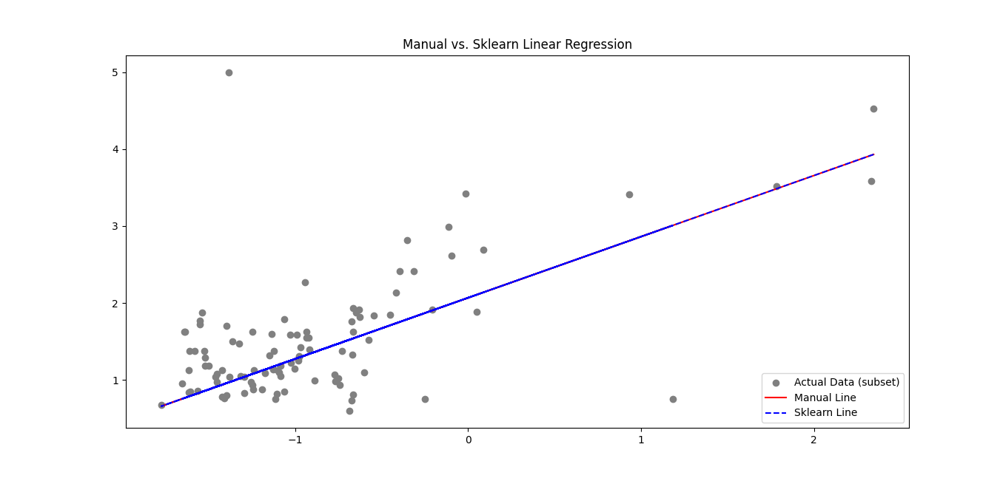
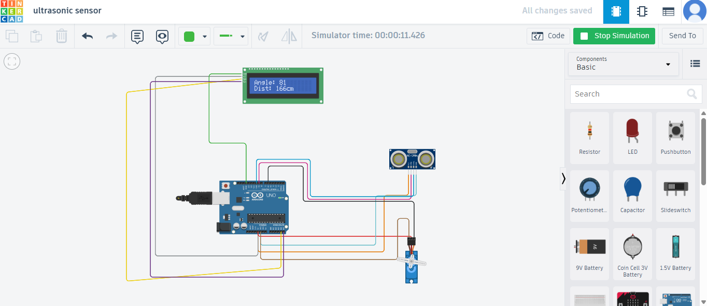
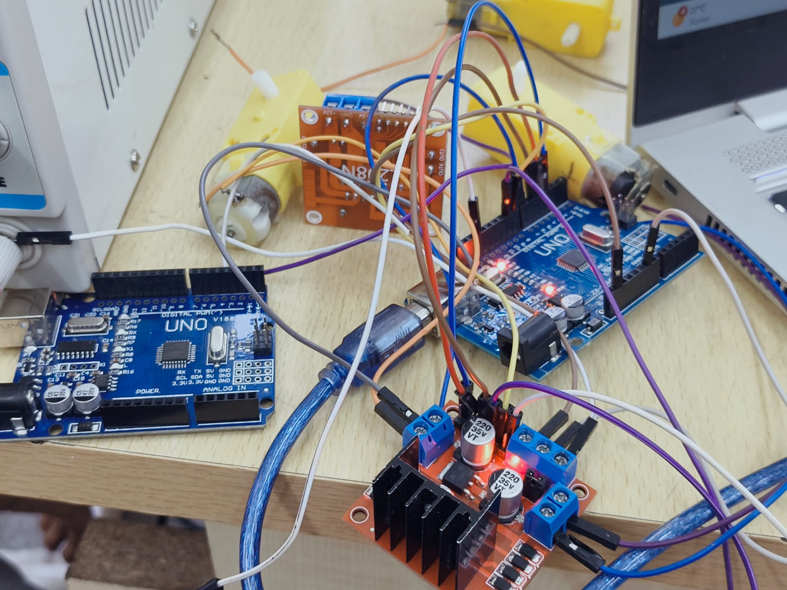
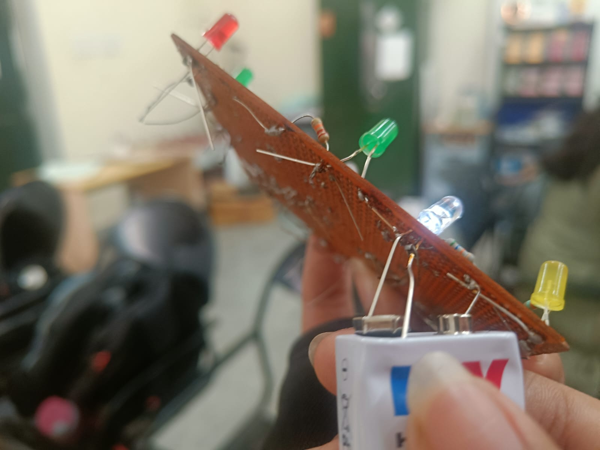
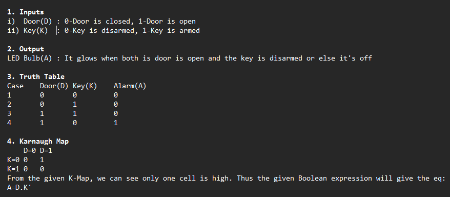
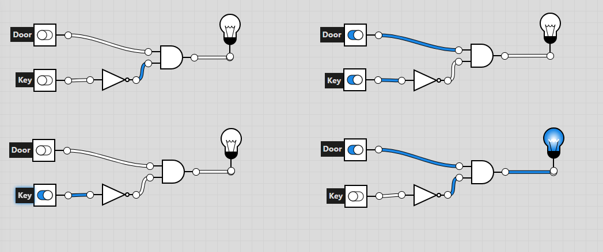
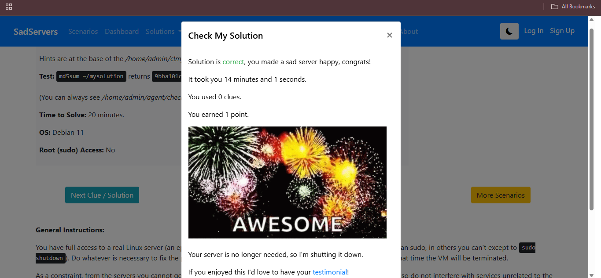

## Task 1: 3D Printing

I spent some time looking into the basics of 3D printing. I went through the SOPs to understand how the machines actually function, specifically focusing on how the print bed needs to be leveled and the importance of safety during operation.

I looked into how 3D models (STL files) are converted into instructions for the printer. I learned about:
* **The Slicing Process:** How a slicer like Cura or Creality Slicer breaks a 3D model into thousands of individual layers.
* **Key Settings:** Why you need to dial in the *bed temperature (around 60°C for PLA)* and *nozzle temperature (usually 200°C–210°C)* to get a good first layer.
* **Print Quality:** How *infill density* and *layer height* affect both the strength of the object and the total print time.

I ended up picking out a _3d 6-faced die_ to test the concept, which was further sliced by the slicing appplication

### Resources Consulted
[Click here to see the STL file I used](https://www.thingiverse.com/thing:7296600)

##  Task 2: Weather App & API Integration

I built a weather app to see how APIs work in real-time. I used the **OpenWeather API** and handled everything with Python.

* **How it works:** Think of the API as a waiter . My Python script sends a request to the weather server, and the API brings back the current conditions in JSON format.
* **The Code:** I used Python's `requests` library to fetch the data. The core of the task was parsing the JSON response to grab specific info like temperature and weather conditions and displaying it in a clean format.
* **The Result:** I can now pull live weather data for any city directly through my terminal/script.

[Click here for the link to the webpage]()

##  Task 3: GitHub Workflow & Contributing

I worked through a hands-on exercise to learn the standard GitHub contribution workflow: **Forking, Branching, and Pull Requests (PRs).**

### How I did it?
The repository I was tasked with had a failing  test (GitHub Actions). I followed these steps to fix it:
1.  **Forking:** Created a personal copy of the repository under my own GitHub account.
2.  **Branching:** Created a new branch to work on the fix without touching the original (main) code.
3.  **The Fix:** Opened `main.py` and `testing.py`, identified why the test was failing, and patched the code.
4.  **Committing & Pushing:** Committed my changes and pushed them to my forked repository.
5.  **Pull Request:** Opened a Pull Request back to the original repository to propose my fix.

[Click here for valid proof](https://github.com/nahhshreeya/git-task)

##  Task 4: Command Line Basics (Ubuntu)

I practiced basic Linux terminal commands to handle file systems and automate repetitive tasks.

1. ***Create and enter the new folder***
`mkdir marvel_task
cd marvel_task`
2. ***Create the blank file***
`touch empty_file.txt`
3. ***Create 2600 folders (The M1, M2... style)***
`mkdir M{1..2600}`
4. ***List them (Fixing that vertical mess)***
To stop it from being one long vertical line, use the -C flag. Also, stretching your terminal window wider before you type this will help it snap into more columns:
`ls -C`
5. ***Concatenate two random text files***
`echo "Task 4 is almost done." > part1.txt
echo "Submitting to MARVEL now!" > part2.txt
cat part1.txt part2.txt`

### Resources
 [Ubuntu Command Line Tutorial](https://ubuntu.com/tutorials/command-line-for-beginners#1-overview)

## Task 5: Linear Regression from Scratch

I implemented a manual Linear Regression model using the California Housing dataset to understand how machine learning models optimize their predictions.

### Technical Implementation
* **Dataset:** Used 'Median Income' as the primary feature to predict house prices.
* **The "Scratch" Logic:** Manually programmed the **Gradient Descent** loop (1000 iterations) to update weights and bias by calculating error gradients.
* **Scaling:** Used `StandardScaler` to normalize the data, which is essential for the manual learning process to converge.
* **Benchmark:** Compared my manual implementation against `sklearn.linear_model.LinearRegression`.

### Key Takeaways
* **Gradients:** Learned how small mathematical adjustments to weights and bias eventually lead to the line of best fit.
* **Library Efficiency:** While the manual code works, `Scikit-Learn` is highly optimized for performance and handling large-scale datasets.

[The code](https://github.com/nahhshreeya/linear-reg-code)

##  Task 6: The Matrix Puzzle — Decoding with NumPy

I solved a visual puzzle by manipulating a scrambled dataset into a hidden image using **NumPy** for data processing and **Matplotlib** for visualization.

### The Decoding Process
To reveal the secret image, I followed the logic provided in the clues:

1.  **Reshaping (The Square Rule):** I calculated the total number of elements in the array and found the square root to determine its dimensions. I then used `np.reshape()` to turn the flat data into a 2D square matrix.
2.  **Orientation Fix (The Sideways Clue):** The data was oriented incorrectly. I used `np.transpose()` (or `.T`) to swap the axes and align the image correctly.
3.  **The "End is the Beginning" Fix:** Based on the hint that the end was actually the start, I used `np.flip()` to reverse the order of the data and bring the image into focus.

[Link to notebook](https://colab.research.google.com/drive/1Pwymp4nmFUUs-RFp41RB26U6TyIOCKho#scrollTo=bgpFodEbgtYw)

##  Task 7: Personal Portfolio Webpage

I designed and deployed a responsive portfolio website to showcase my academic background, technical projects, and personal interests.

### Features & Implementation
* **Responsive Design:** The site is built to be accessible across mobile, tablet, and desktop views.
* **Tech Stack:** * **HTML5/CSS3:** Used for the core structure and a minimalist, "grounded" aesthetic.
    * **Markdown:** Utilized for documentation and content drafting.
    * **VS Code:** Primary environment for development and local testing.
* **Deployment:** Hosted via **GitHub Pages**, ensuring the site is live and integrated with my version control workflow.

### My Live Portfolio
* [View My Portfolio Website Here](https://nahhshreeya.github.io/my-portfolio-site/)
* [Link to Source Code](https://github.com/nahhshreeya/my-portfolio-site)

##  Task 8: Technical Resource Article (Markdown)

I authored and published a technical article on **Dark Matter** for the MARVEL website, using Markdown to ensure clean formatting and cross-platform consistency.

### Key Outcome
Mastered Markdown syntax (headers, links, and lists) to document complex astrophysical concepts without relying on traditional text editors.

[Read the Full Article Here](https://github.com/nahhshreeya/dark-matter-article/blob/main/README.md)

##  Task 9: Tinkercad

I designed and simulated a digital radar system using **Tinkercad** to explore the integration of ultrasonic sensors and servo motors for spatial object detection.

### Technical Implementation
* **Sensing:** Used the **HC-SR04 ultrasonic sensor** to measure distance based on sound wave "time of flight."
* **Scanning:** Integrated a **Servo motor** to rotate the sensor from 0° to 180°, creating a semi-circular detection sweep.
* **Monitoring:** Programmed the Arduino to stream real-time angle and distance coordinates to the **Serial Monitor**.

##  Task 10: Speed Control of DC Motor 

I implemented a speed control system for a 5V  motor using an **L298N H-Bridge motor driver** and an **Arduino Uno**, progressing from virtual simulation to physical hardware.

### Technical Implementation
* **Motor Driving:** Used the **L298N driver** to handle the high current requirements of the motor, which the Arduino pins cannot provide directly.
* **Speed Regulation:** Applied **Pulse Width Modulation (PWM)** via the `analogWrite()` function to vary the average voltage supplied to the motor, effectively controlling its RPM.
* **H-Bridge Logic:** Configured the input pins (IN1, IN2) to set the direction of rotation and the Enable pin (ENA) to regulate speed.

### Workflow
1.  **Tinkercad Simulation:** Verified the wiring and PWM logic in a virtual environment to ensure the H-Bridge was switching correctly.
2.  **Hardware Assembly:** Wired the physical 5V BO motor to the L298N and powered it using an external battery source to prevent drawing excessive current from the Arduino.
3.  **Testing:** Recorded the motor transitions from low speed to high speed and verified direction control.

## Task 12: Soldering 

I learned the fundamentals of  soldering, focusing on equipment safety and technique while assembling a basic LED circuit on a perf board.

### Soldering Toolkit
* **Soldering Iron:** Used to heat the component leads and the copper pad on the perf board.
* **Solder (Lead-free):** The filler metal used to create a permanent mechanical and electrical bond.
* **Flux:** Applied to prevent oxidation and help the solder flow smoothly onto the joints.
* **Soldering Wick & Pump:** Utilized for desoldering and correcting excess solder or "bridges."
* **Stand & Brass Sponge:** Essential for safely resting the iron and cleaning the tip between joints.

### Implementation: LED Circuit
Under the supervision of a lab coordinator, I soldered a simple LED and resistor circuit:
1.  **Preparation:** Cleaned the iron tip and tinned it for better heat transfer.
2.  **Placement:** Mounted components through the perf board and bent leads slightly to secure them.
3.  **The Joint:** Heated the pad and the lead simultaneously for 2-3 seconds before applying solder to create a "volcano" shaped joint.
4.  **Finishing:** Clipped excess leads using a wire cutter once the joints cooled.

## Task 14: K-Map
Here's the logic of the **burglar alarm**:

Here's the **Circuit**:

##  Task 16: Datasheet Report — MQ135 Gas Sensor

I studied the MQ135 datasheet to understand its operational parameters, calibration requirements, and the mathematical principles behind its gas sensing capabilities.

### Technical Specifications
* **Sensor Type:** SnO2 semiconductor (conductivity increases with gas concentration).
* **Target Gases:** Ammonia (NH3), Nitrogen oxides (NOx), Alcohol, Benzene, Smoke, and CO2.
* **Operating Voltage:** 5V.
* **Output:** Analog (AO) for ppm concentration; Digital (DO) for threshold alerts.

### The Math
* **Freundlich Adsorption:** The sensor follows the formula $x/m = K P^{1/n}$, modeling how gas molecules adsorb onto the sensor surface.

[Click here for the link to my report](https://github.com/nahhshreeya/mq-135-datasheet/blob/main/report.md)

## Task 17: Virtual Reality
I went through a couple YouTube videos and useful resources to learn the basics of _AR and VR_.
[Link to the rep](https://github.com/nahhshreeya/virtual-reality-rep)
##  Task 18: SadServers – Command Line Murders

I tackled the **Command Line Murders** challenge on SadServers, utilizing Linux system administration tools to investigate logs, process trees, and file activity to identify the perpetrator.

### Troubleshooting Toolkit
* Using the `cd` command to change between the clmystery, mystery and other directories.
* Using `ls` to list the content of the directories.
* Using `cat` to see the content of the file
* Using `grep` to parse through the contents of the file.
* Using `head -n (no.) file_name` to access a couple of lines from the beginning of the file

### The Investigation Flow
1. Initially analysed the instructions in the clmystery directory.
2. Accessed various files and directories in `mystery`.
3. Got a clue which turned out to be false.
4. Analysed again to find the real culprit and identified him to make the server **HAPPYY :)**

##  Task 20: Notebook Ninja (Jupyter Foundations)

I completed the Jupyter Notebook challenges, focusing on Markdown structuring, cell-type management, and integrated data visualization.

### Completed Challenges:
* **Markdown Skills:** Implemented headers, bulleted lists, and formatted text for documentation.
* **Coding & Viz:** Executed Python calculations and generated plots using `Matplotlib`.
* **Workflow:** Organized the notebook into logical sections using headers and proper cell-type usage (Code vs. Markdown).

### Documentation:
[Click here for the link](https://github.com/nahhshreeya/jupyter-task)

##  Task 21: Machine Learning – Intro & Data Preparation

I studied the foundations of Machine Learning and the essential data preparation pipeline to understand how raw information is transformed into actionable models.

[Click here for link to my article](https://github.com/nahhshreeya/intro-to-ml/blob/main/aimlintro.md)
***
*Thank YOU*